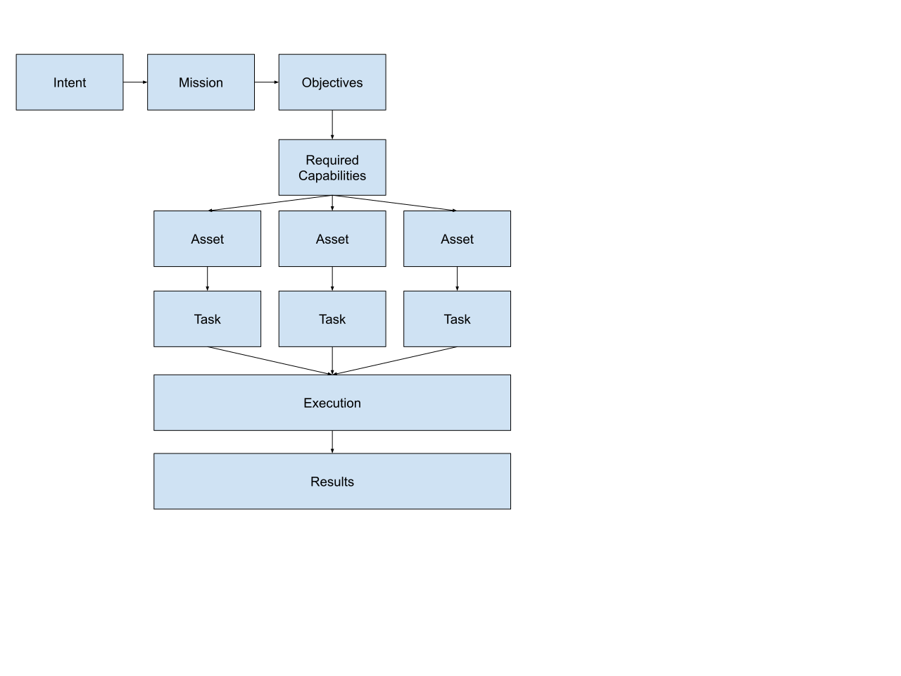

# Principle

Intent defines what should happen.

Mission defines how success is measured.

Capabilities define what can be done.

Assets provide capabilities.

Participants execute tasks.

Swarms coordinate participants.

Resources enable execution.

Settlement accounts for value exchange.

That’s clean enough that a human operator, an LLM planner, a drone autopilot, and a marketplace service could all speak the same conceptual language.

